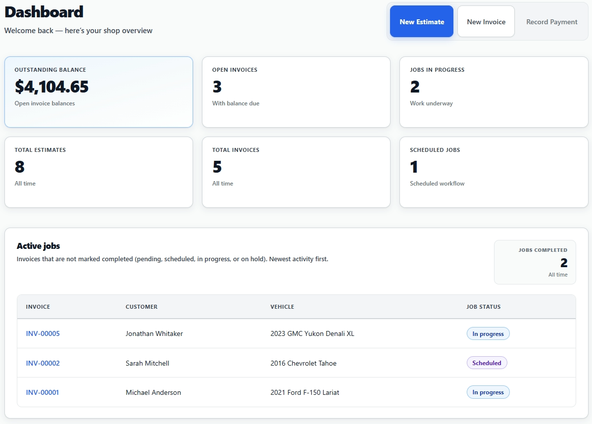
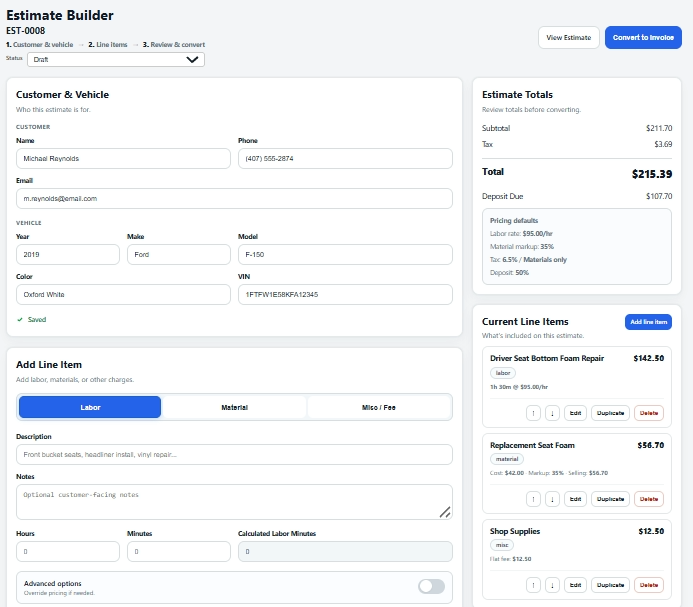
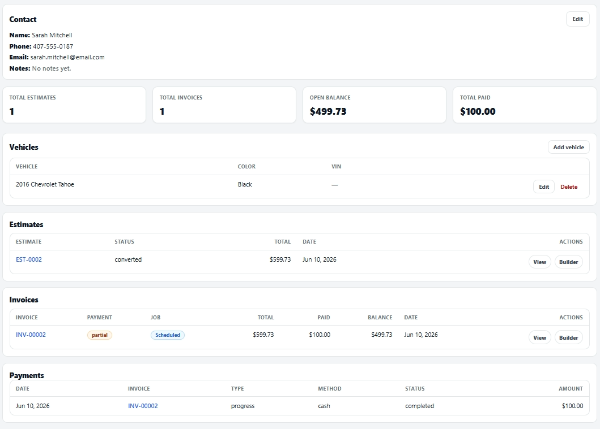
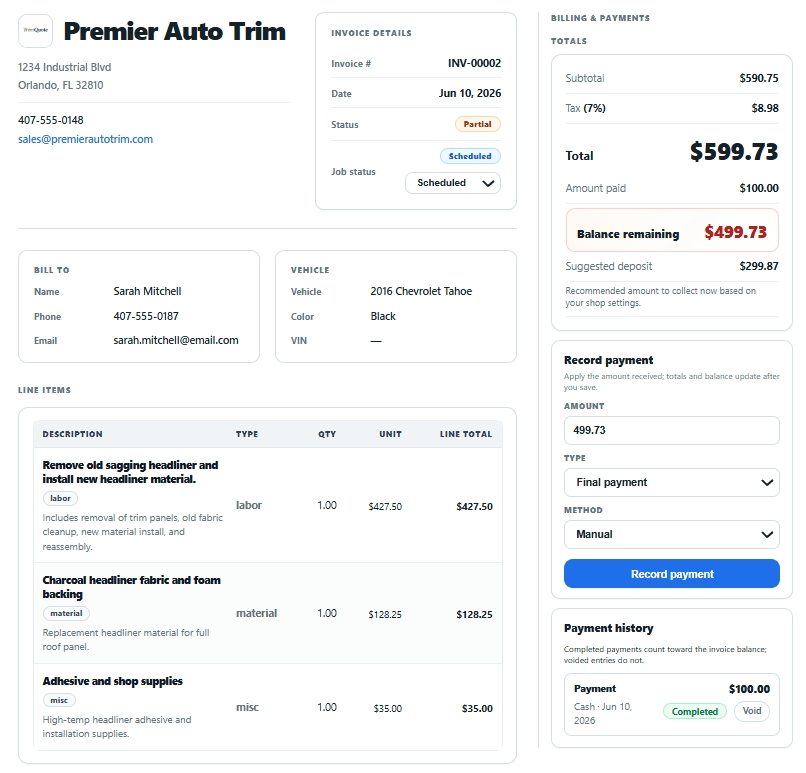

# TrimQuote

Professional quoting and shop management software for automotive upholstery shops.

TrimQuote helps upholstery shops create accurate quotes, manage customers, track jobs, handle deposits, and keep quoting consistent.

## Built for upholstery shops

TrimQuote is designed specifically for automotive upholstery workflows — not generic business quoting.

## Key features

- Job quoting
- Customer management
- Shop dashboard
- Stripe subscriptions
- Photo uploads
- Quote history
- Business reporting

- ## Screenshots

### Dashboard

The dashboard gives shop owners an instant overview of invoices, estimates, jobs in progress, scheduled work, and outstanding balances.

---

### Estimate Builder

Create professional estimates quickly using TrimQuote's workflow designed specifically for automotive upholstery shops.

---

### Customer Management

Keep customer information, vehicles, estimates, invoices, and payment history together in one place.

---

### Invoicing

Generate invoices, record payments, and track outstanding balances from a single interface.

## Status

TrimQuote v1 is live.

Website: https://trimquoteapp.com  
App: https://app.trimquoteapp.com

## Built by

TrimQuote is built by a working automotive upholsterer to solve real quoting and shop management problems.
